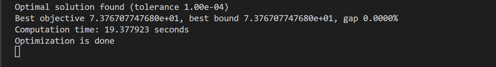
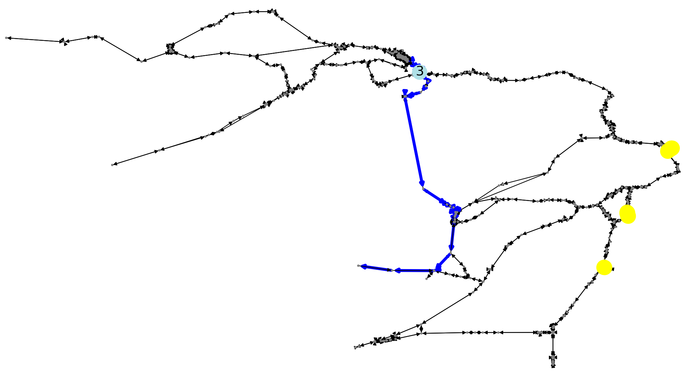
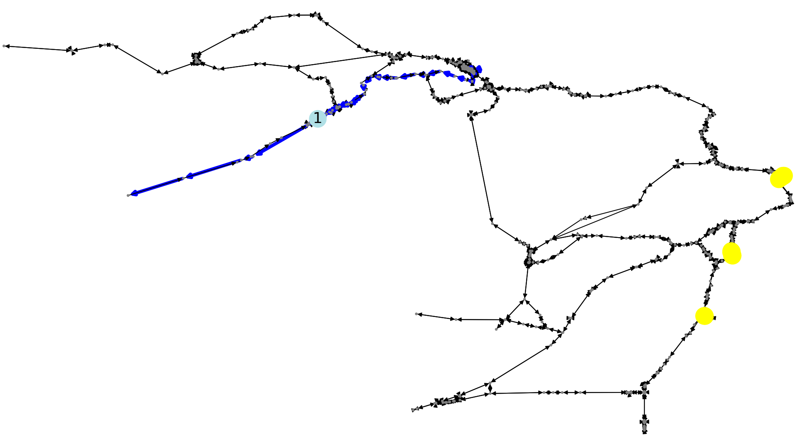
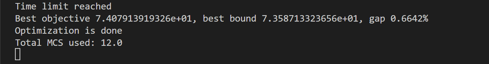
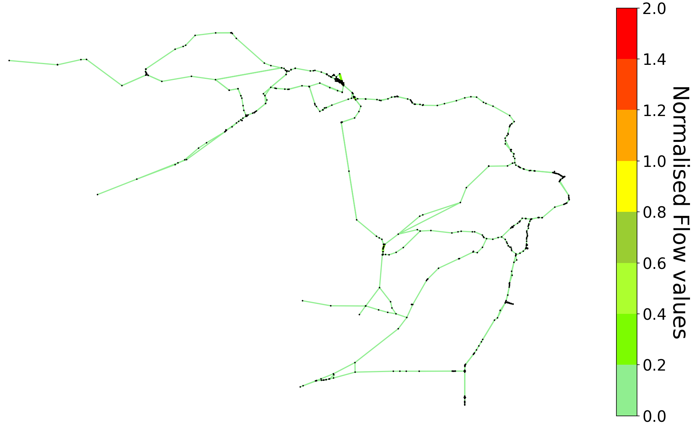
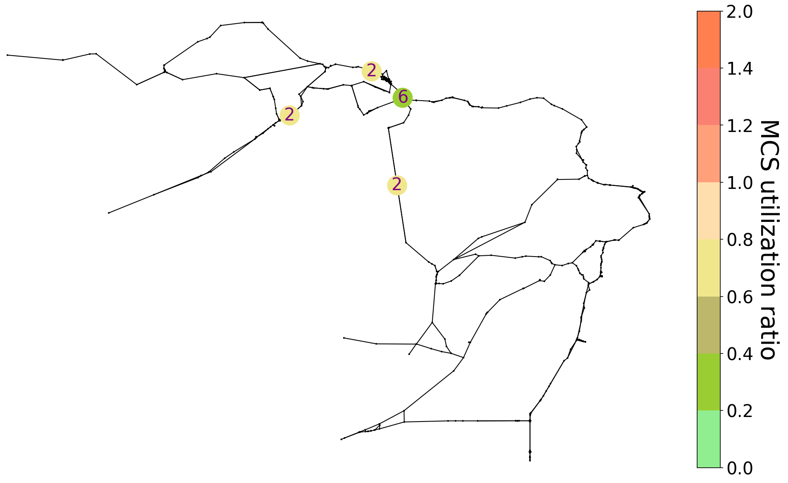

## Overview
This repository contains the source code associated with the paper “Equivalent Circuit Model–based Electric Vehicle Evacuation with Mobile Charging Stations.” The proposed framework uses an Equivalent Circuit Model (ECM) to jointly optimize evacuation routing, EV charging decisions, and the deployment of Mobile Charging Stations (MCSs). The model accounts for vehicle driving-range limitations, road-capacity constraints, Fixed Charging Station (FCS) availability, and MCS deployment and charging-capacity constraints.

The repository includes the optimization codes and supporting files used to generate the numerical results and case studies presented in the paper.

### 1. OS Compatibility
This guide describes an installation and development workflow for Windows operating systems (Windows 10 and 11). It has not been tested on macOS or Linux, although it should work with minor or no modifications if the required dependencies are installed correctly.

### 2. Project Architecture
```text
ECM_optimization/
├── Optimization_code.py                   # Main ECM-based evacuation optimization
├── MILP_solve_tmax_unidirectional.py      # Maximum evacuation-time objective
├── MILP_solve_t_avg_unidirectional.py     # Average evacuation-time objective
├── MILP_solve_t_avg_sd_unidirectional.py  # Average/deviation-based objective
├── Optimization_code_MCS_utility_plot.py  # MCS utilization analysis and plotting
├── plot_map_networkx_unidirectional.py    # Transportation-network visualization
├── requirements.txt                       # List of additional Python packages to be installed 
│
├── GeoJson/                               # Mariposa transportation-network data
│   ├── centroids.geojson
│   ├── centroid_connections.geojson
│   ├── nodes.geojson
│   ├── sections.geojson
│   ├── turnings.geojson
│   └── LinkFlowStatistics_NormalFlow_v20250916a.txt
│
├── Miscellaneous Plots/                       # Additional plots for some sensitivity analysis w.r.t. baseline parameters
|   ├── Additional_Plots.py                    # Additional result visualization
|   ├── Mariposa_analysis.xlsx                 # Analysis and simulation results
|   ├── Mariposa_plots.xlsx                    # Data used for generating plots
| 
└── Uncoordinated evac planning/               # Baseline evacuation-planning approach
|   ├── baseline_algorithm_MCS_plotting.py
|   └── config.py
|
└── images/
    ├── optimization_done.png
    ├── optimization_MCS_done.png
    ├── image_1.png
    ├── image_2.png
    ├── image_3.png
    └── image_4.png
```
### 3. Installation

###### Requirements

The codebase was developed and tested using:

- Python 3.12
- Gurobi Optimizer
- Gurobi Python interface (`gurobipy`)
- Additional Python packages listed in `requirements.txt`

> **Platform note:** The code has been tested on Windows. macOS and Linux are currently untested and may require minor environment- or path-related adjustments.

---

###### 1. Install Python 3.12

Download and install Python 3.12 from the official Python website:

https://www.python.org/downloads/

Verify the installation using:

```bash
python --version
```

or, depending on your system:

```bash
python3 --version
```

The output should indicate Python 3.12.

---

###### 2. Install the Required Python Packages

Upgrade `pip` first:

```bash
python -m pip install --upgrade pip
```

If a `requirements.txt` file is provided, install all required packages using:

```bash
pip install -r requirements.txt
```

Alternatively, the packages can be installed individually as needed.

---

###### 3. Install Gurobi

The optimization problems in this repository are solved using **Gurobi Optimizer**.

Install the Gurobi Python interface using:

```bash
pip install gurobipy
```

Verify that `gurobipy` is installed correctly:

```bash
python -c "import gurobipy; print(gurobipy.gurobi.version())"
```

---

###### 4. Configure a Gurobi License

A valid Gurobi license is required to solve the optimization problems.

Please obtain and configure an appropriate Gurobi license by following the instructions provided by Gurobi:

https://www.gurobi.com/downloads/

Depending on your license type, additional license-activation steps may be required.

Academic users may be eligible for a free academic license subject to Gurobi's licensing requirements.

After configuring the license, you can verify that Gurobi is working by running:

```bash
python -c "import gurobipy as gp; m = gp.Model(); print('Gurobi installation successful')"
```

If no license-related error is displayed, Gurobi should be ready to use.

---

### 4. Running the Code

The repository contains two main optimization scripts:

- `Optimization_code.py`
- `Optimization_code_MCS_utility_plot.py`

Both scripts solve the evacuation-planning problem using Gurobi and generate route visualizations for the considered origin-destination (OD) pairs.

###### 1. Running `Optimization_code.py`

Run the main optimization script using:

```bash
python Optimization_code.py
```

If the optimization is completed successfully, the terminal will display a message indicating that an optimal solution has been found, together with information such as the objective value, optimality gap, and computation time.

Example:

```text
Optimal solution found
Best objective ...
Best bound ...
gap 0.0000%
Computation time: ... seconds
Optimization is done
```

An example of the successful terminal output is shown below:



The script also generates **seven routing plots**, one for each OD pair considered in the simulation. The optimal evacuation route for each OD pair is highlighted in blue.

Example routing plots are shown below:

<p align="center">
  
  
</p>

---

###### 2. Running `Optimization_code_MCS_utility_plot.py`

Run the MCS-utilization analysis script using:

```bash
python Optimization_code_MCS_utility_plot.py
```

This script solves the evacuation optimization problem while also evaluating the utilization of the deployed Mobile Charging Stations (MCSs).

If the script runs successfully, the terminal displays the optimization status, objective value, best bound, optimality gap, and the total number of MCS units used.

Example:

```text
Time limit reached
Best objective ...
Best bound ...
gap ...
Optimization is done
Total MCS used: ...
```

An example of the terminal output is shown below:



The script also generates **seven routing plots**, corresponding to the considered OD pairs, together with additional information related to MCS deployment and utilization.

Example outputs are shown below:

<p align="center">
  
  
</p>

Make sure that the required input files and folders remain in their expected locations within the repository.

---

######## Troubleshooting

######### `ModuleNotFoundError`

If Python reports that a package is missing, install it using:

```bash
pip install <package-name>
```

######### Gurobi License Error

If Gurobi reports a license error, verify that:

1. A valid Gurobi license has been obtained.
2. The license has been correctly configured for your system.
3. The Python environment contains the `gurobipy` package.

######### File Not Found Error

The scripts use input files located within the repository. Run the scripts from the appropriate project directory and avoid changing the folder structure unless the corresponding file paths in the code are also updated.
